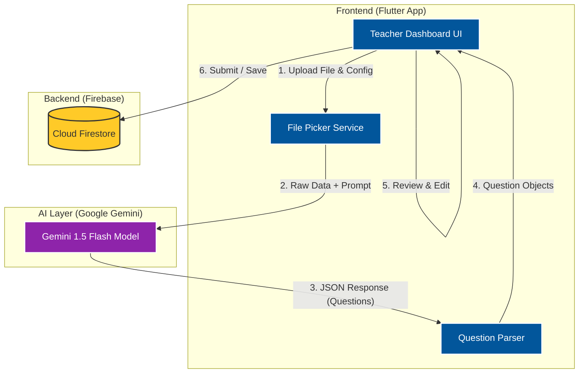

# System Architecture

This document outlines the high-level architecture of the **QuizMe** application, specifically the AI-powered assignment creation flow.

## High-Level Data Flow

1.  **Teacher Input (Flutter)**: The teacher selects a file (PDF/DOCX) and configures the quiz (types, ranges).
2.  **AI Processing (Gemini)**: The app sends the file data and prompt to the Gemini API. Gemini returns a structured JSON of questions.
3.  **Review (Flutter)**: The teacher reviews, edits, and approves the generated questions in the UI.
4.  **Storage (Firebase)**: The final approved assignment is saved to Firestore.

## Architecture Diagram

## Detailed Process

1.  **Input Collection**:
    *   **Flutter UI** collects the File (PDF, DOCX, etc.) and `selectedRanges` (e.g., "Multiple Choice: 1-10").
    *   `AiQuestionService` prepares a **Prompt** that tells Gemini exactly how to format the output.

2.  **AI Generation**:
    *   The app sends the **Prompt** + **File Data** (as Bytes) to `gemini-flash-latest`.
    *   Gemini analyzes the document text and generates questions matching the requested types and counts.
    *   It returns a **JSON String** containing the questions, options, and answers.

3.  **Parsing & Review**:
    *   The app decodes the JSON into Dart `Question` objects.
    *   These objects are displayed in the `AddQuestionsScreen` for the teacher to review.
    *   **Editing**: If the teacher modifies a question (using the new Modal), the local Dart object is updated.

4.  **Persistence**:
    *   When "Submit" is clicked, the app takes the list of `Question` objects.
    *   It creates a structured document in the `assignments` collection in **Firestore**.
    *   Students then query this Firestore collection to take the quiz.
